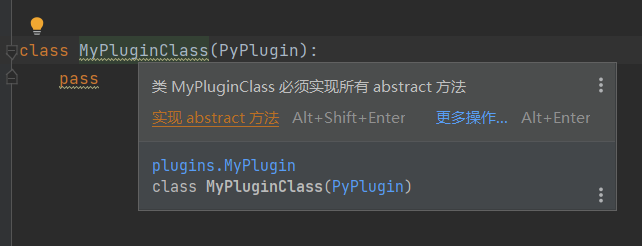

## Bot类

Bot类是你的插件与mirai（qq）通信的桥梁，由MPL实例化并传递到你的插件中，通过对象方法进行发送消息等交互操作


------

## PyPlugin类

plugin模块下的PyPlugin类，封装了MPL插件的功能，你需要继承PyPlugin类，来定义你的插件

**注意，必须在\_\_init_\_\.py文件中定义你的插件类**

通过重写PyPlugin类的抽象方法，实现插件的功能



在`version`方法中定义你的插件版本，使用x.y.z规范

```python
@property
def version(self) -> tuple[int, int, int]:
    return 0,0,1
```

`on_create`方法在MPL加载你的插件时调用

```python
def on_create(self):
    self.get_logger().info('已加载我的插件！') # 输出日志到控制台
```

每当一个bot登录时，都会调用一次`on_login`方法，你必须通过Bot对象中的`register_plugin`方法在这个bot中注册你的插件

```python
async def on_login(self, bot: Bot):
   bot.register_plugin(self) # 注册你的插件到Bot
   self.get_logger().info(f'在Bot:{bot.bot_qq} 中注册了我的插件！')
```

不管bot何种方式登出（包括被封禁，强制退出mcl），都会调用`on_logout`方法

```python
async def on_logout(self, bot: Bot):
   self.get_logger().info(f'Bot:{bot.bot_qq} 登出！')
```

MPL接收的消息发送者可分为三类

- group（群聊消息）
- friend（好友私聊消息）
- admin（插件管理员的消息）插件管理员将在[Permission]()中说明

通过实现以下三个方法来实现你的插件功能

```python
async def get_group_msg(self, bot: Bot, source: msg.Source, message: msg.MsgChain):
   self.get_logger().info(f'收到了来自群{source.group} {source.sender}发送的消息')

async def get_friend_msg(self, bot: Bot, source: msg.Source, message: msg.MsgChain):
   self.get_logger().info(f'收到了来自好友{source.sender}发送的消息')

async def get_admin_msg(self, bot: Bot, source: msg.Source, message: msg.MsgChain):
   self.get_logger().info(f'收到了来自管理员{source.sender}发送的消息')
```


------

## Msg类

MPL收发的所有消息，都是Msg类的子类，以下介绍几个常见的子类

------

### PlainMsg(文本消息)

这是一个文本消息，消息的文本存放于PlainMsg类的text字段中

你可以通过实例化该类，来创建一个文本消息

```python
	bot:Bot # bot为Bot类对象
    text_msg = msg.PlainMsg('Hello,World') # 创建一个Hello World文本消息
	bot.send_group_msg(text_msg, group) # 发送该消息至群group
```

------

### ImageMsg(图片消息)

这是一个图片消息

MPL支持通过url、base64字符串、路径（相对路径指向mcl运行目录，绝对路径指向mcl运行的服务器/主机，因此不推荐使用）来创建图片消息

请注意，接收的图片消息只有url属性

```python
	bot:Bot # bot为Bot类对象
    img_msg = msg.ImageMsg('http://image-url', msg.ImageMsg.URL) # 通过url创建一个图片消息
	bot.send_group_msg(img_msg, group) # 发送该消息至群group
```

------

### MsgChain(消息链)

消息可以是文本，也可以是图片，或其他。如果当一个消息既有文本又有图片时，就需要一个载体来包装这个消息，MsgChain就起到了这个载体的作用，它是一个有序的消息集合。

接收的消息无论如何都会被MsgChain所包装，通过其中的get方法来获取对应的消息

```python
    message: msg.MsgChain  # 接收的消息
    text_msg_list = message.get_plain_msg()  # 获取消息链中所有的文本消息
    for text_msg in text_msg_list:  # 遍历所有文本消息
        text = text_msg.text
        self.get_logger().info(f'接收到了文本消息:{text}')
```

```python
	bot:Bot # bot为Bot类对象
    chain = msg.MsgChain() # 创建一个消息链
    text_msg = msg.PlainMsg('Hello,World') # 创建一个Hello World文本消息
    img_msg = msg.ImageMsg('http://image-url', msg.ImageMsg.URL) # 通过url创建一个图片消息
    chain.add_msg(text_msg) # 将文本消息添加到消息链中
    chain.add_msg(img_msg) # 将图片消息添加到消息链中
    bot.send_group_msg(chain, group) # 发送该消息链至群group
```

